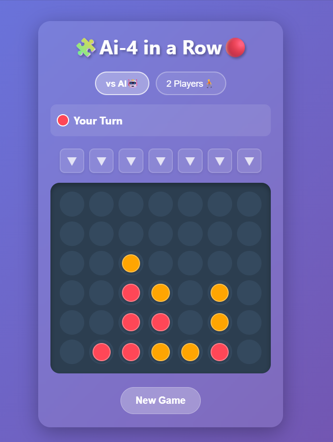
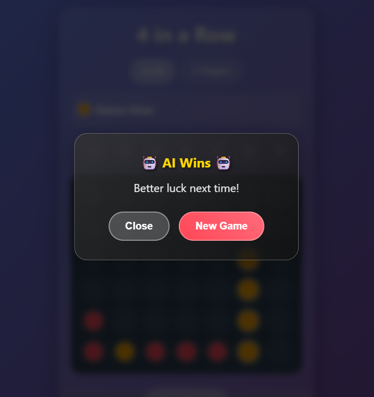

# 🤖 AI Powered 4 in a Row Game 🎮

# 🎉 🕹️ Play Live Now 😊  
👉 **[🚀 Click Here to Play the AI Game Live](https://ai-4-in-a-row-game.netlify.app/)** 👈  

---

## 🌟 Project Overview

This is not just a normal Connect Four game.

This project demonstrates:

🧠 Artificial Intelligence decision logic  
📊 Explainable AI (XAI) metrics  
🎮 Interactive game design  
🌐 Cloud deployment using Netlify  

Built as part of my AIML journey to showcase intelligent game development.

---

## 🖼️ Game Screenshots

### 🎮 Playing Mode

### 🏆 Game Complete View

---

## 🔥 What Makes This Different from Normal Games?

| Normal 4-in-a-Row | 🚀 This AI Version |
|-------------------|-------------------|
| Random or static logic | 🧠 Intelligent decision logic |
| No transparency | 📊 AI Explanation Panel |
| No evaluation scoring | 🎯 Position scoring system |
| Fixed gameplay | 🤖 Strategy-based AI |
| No insight into decisions | 🔍 Shows confidence & win probability |

---

## 🤖 AI Features Included

### 🧠 Intelligent Decision System
The AI evaluates:

- 🏆 Winning opportunities  
- 🛑 Blocking threats  
- 🎯 Strategic board positions  
- 📊 Move scoring & prioritization  

---

### 📊 Explainable AI Panel (XAI)

When AI makes a move, it displays:

- 🤖 Strategy Used  
- 📈 Positions Evaluated  
- 🎯 Best Move Score  
- 💯 Confidence Percentage  
- 📊 Estimated Winning Probability  

This highlights transparency in decision-making.

---

## 🎮 Game Modes

- 👤 Player vs AI  
- 👥 Player vs Player  

---

## 🎨 UI Highlights

- 🌈 Modern gradient UI  
- 💎 Glassmorphism styling  
- 🟡 Animated interactive buttons  
- 📱 Mobile responsive design  

---

## 🛠️ Technologies Used

- HTML5  
- CSS3  
- Vanilla JavaScript  
- Netlify (Cloud Deployment)

---

## 🧠 AI Decision Pipeline

The AI follows a structured evaluation strategy:

1️⃣ Check for immediate win  
2️⃣ Block opponent threats  
3️⃣ Evaluate all valid moves  
4️⃣ Score board positions  
5️⃣ Choose highest scoring move  
6️⃣ Display explanation metrics  

Demonstrates understanding of:

- Heuristic-based evaluation  
- Game state analysis  
- Explainable AI concepts  
- Intelligent system transparency  

---

## 🚀 Deployment

🌐 Hosted on Netlify  
🔄 Auto-deployed from GitHub  

Live URL:  
👉 https://ai-4-in-a-row-game.netlify.app/

---

## 🎯 Why I Built This

As an AI & ML student, I wanted to:

✔ Apply theoretical AI knowledge into a practical project  
✔ Demonstrate intelligent decision-making systems  
✔ Practice explainable AI techniques  
✔ Strengthen my GitHub portfolio  

---

## 🔮 Future Enhancements

- 🔥 Minimax with Alpha-Beta Pruning  
- 🧠 Reinforcement Learning version  
- 📊 AI Difficulty levels  
- 📈 Performance analytics dashboard  
- 🏆 ELO rating system  

---

## 💼 About Me

I am an AI & Machine Learning student passionate about:

🧠 Intelligent Systems  
🎮 AI in Games  
📊 Data-driven decision making  
🌐 Real-world AI applications  

I enjoy combining machine learning principles with interactive applications.

---

## ⭐ Final Professional Statement

This project demonstrates my ability to design, implement, and deploy intelligent systems with explainable decision logic and user-focused interaction.

🚀 I am continuously working to build smarter, more advanced AI-driven applications.

More AI-powered projects coming soon!
